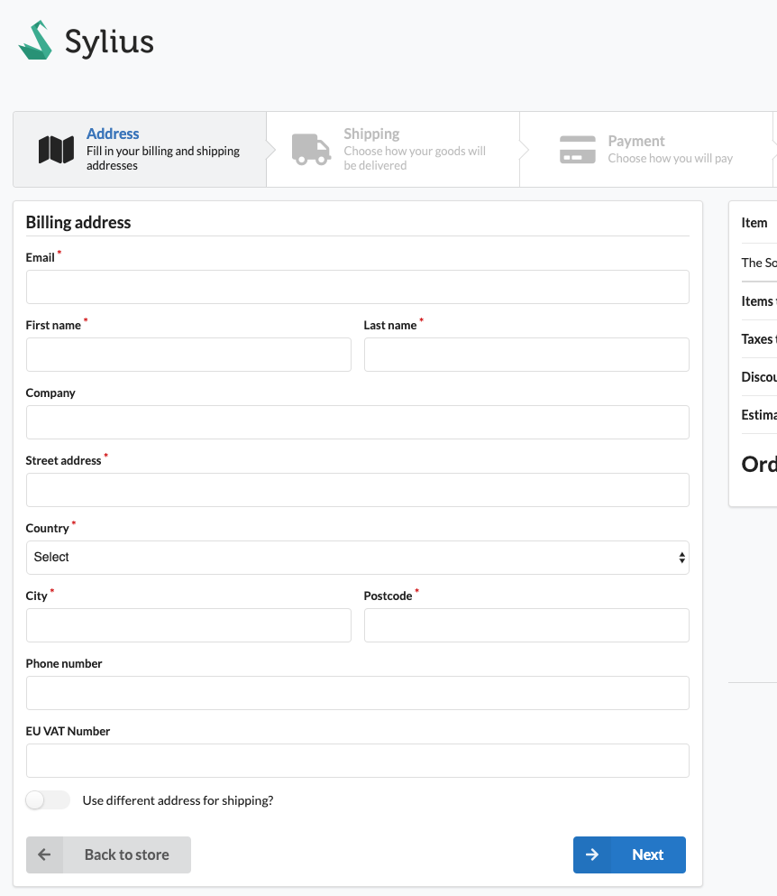
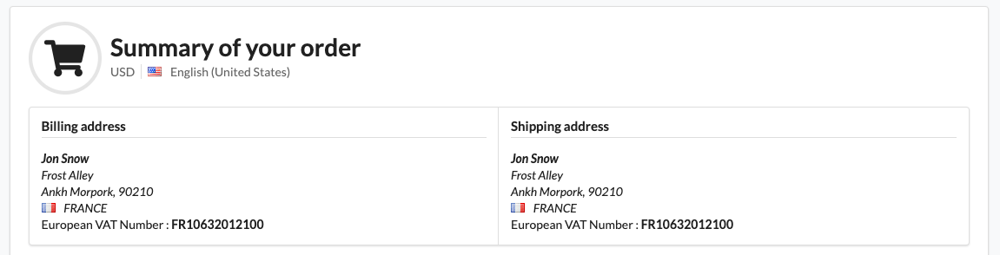
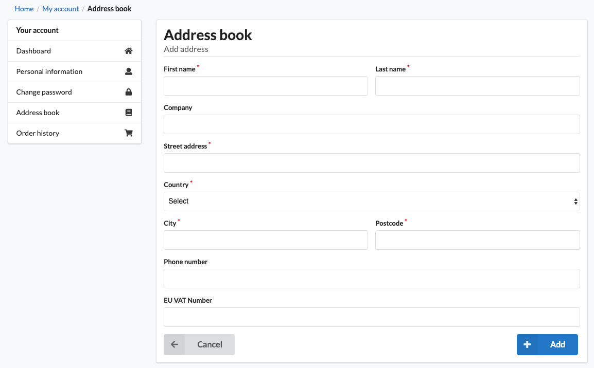
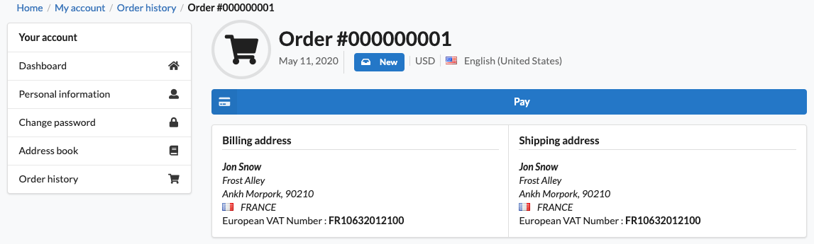

[![Latest Version on Packagist][ico-version]][link-packagist]
[![Software License][ico-license]](LICENSE)
[![Build Status][ico-github-actions]][link-github-actions]
[![Quality Score][ico-code-quality]][link-code-quality]

# EU VAT field and validation for Sylius using VIES API Webservice

This plugin is adding :

- two new attributes to the `Channel` entity allowing to know from
  which country your shop is from and what's the European zone to target
- VAT Number field to the `Address` entity
- validation over VIES API on this field
- validation of the address country (vat number country should equal to the address country)
- the basic European rule allowing the seller not to charge
  VAT to foreign European customers who have provided a valid VAT number :
    - (Shop country === customer country vat number) then do nothing
    - (Shop country !== customer country vat number) then remove taxes

## Screenshots

### Shop checkout





### Shop account





## Installation

```bash
composer require flux-se/sylius-eu-vat-plugin
```
## Configuration

Enable this plugin :

```php
<?php

# config/bundles.php

return [
    // ...
    FluxSE\SyliusEUVatPlugin\FluxSESyliusEUVatPlugin::class => ['all' => true],
    // ...
];
```

Add default config if you want to get access to the default fixtures this plugin need.

```yaml
# config/packages/flux_se_sylius_eu_vat.yaml

imports:
    - { resource: "@FluxSESyliusEUVatPlugin/config/config.yaml" }
    # If you are using SyliusAdminBundle
    - { resource: "@FluxSESyliusEUVatPlugin/config/admin.yaml" }

```

Copy Sylius overridden templates to your templates directory (e.g `templates/bundles/`):

```bash
# If you are using SyliusAdminBundle
mkdir -p templates/bundles/SyliusAdminBundle/
cp -R vendor/flux-se/sylius-eu-vat-plugin/templates/SyliusAdminBundle/* templates/bundles/SyliusAdminBundle/

# If you are using SyliusShopBundle
mkdir -p templates/bundles/SyliusShopBundle/
cp -R vendor/flux-se/sylius-eu-vat-plugin/templates/SyliusShopBundle/* templates/bundles/SyliusShopBundle/
```

Update `Channel` entity : `src/Entity/Channel/Channel.php`

```php
<?php

declare(strict_types=1);

namespace App\Entity\Channel;

use Doctrine\ORM\Mapping as ORM;
use FluxSE\SyliusEUVatPlugin\Entity\EuropeanChannelAwareTrait;
use Sylius\Component\Core\Model\Channel as BaseChannel;

/**
 * @ORM\Entity()
 * @ORM\Table(name="sylius_channel")
 */
#[ORM\Entity]
#[ORM\Table(name: 'sylius_channel')]
class Channel extends BaseChannel implements ChannelInterface
{
    use EuropeanChannelAwareTrait;
}
```

And the corresponding interface : `src/Entity/Channel/ChannelInterface.php`

```php
<?php

declare(strict_types=1);

namespace App\Entity\Channel;

use FluxSE\SyliusEUVatPlugin\Entity\EuropeanChannelAwareInterface;
use Sylius\Component\Core\Model\ChannelInterface as BaseChannelInterface;

interface ChannelInterface extends BaseChannelInterface, EuropeanChannelAwareInterface
{
}
```

<details>
  <summary>Click me : if you are using YAML ORM definitions</summary>

```yaml
# config/doctrine/Address.orm.yml

App\Entity\Adressing\Address :
    type: entity
    table: sylius_address

    fields:
        vatNumber:
            name: vat_number
            type: string
            nullable: true
```
</details>

Then change the default Sylius model class :

```yaml
# config/packages/sylius_channel.yaml

sylius_channel:
    resources:
        channel:
            classes:
                model: App\Entity\Channel\Channel
```

Update `Address` entity : `src/Entity/Addressing/Address.php`

```php
<?php

declare(strict_types=1);

namespace App\Entity\Addressing;

use Doctrine\ORM\Mapping as ORM;
use FluxSE\SyliusEUVatPlugin\Entity\VATNumberAwareTrait;
use Sylius\Component\Core\Model\Address as BaseAddress;

/**
 * @ORM\Entity()
 * @ORM\Table(name="sylius_address")
 */
#[ORM\Entity]
#[ORM\Table(name: 'sylius_address')]
class Address extends BaseAddress implements AddressInterface
{
    use VATNumberAwareTrait;
}
```

And the corresponding interface : `src/Entity/Addressing/AddressInterface.php`

```php
<?php

declare(strict_types=1);

namespace App\Entity\Addressing;

use FluxSE\SyliusEUVatPlugin\Entity\VATNumberAwareInterface;
use Sylius\Component\Core\Model\AddressInterface as BaseAddressInterface;

interface AddressInterface extends BaseAddressInterface, VATNumberAwareInterface
{
}
```

<details>
  <summary>Click me : if you are using YAML ORM definitions</summary>

```yaml
# config/doctrine/Channel.orm.yml

App\Entity\Channel\Channel:
    type: entity
    table: sylius_channel

    manyToOne:
        baseCountry:
            targetEntity: Sylius\Component\Addressing\Model\CountryInterface
            fetch: EAGER
            joinColumn:
                name: base_country_id
                onDelete: "SET NULL"
        europeanZone:
            targetEntity: Sylius\Component\Addressing\Model\ZoneInterface
            fetch: EAGER
            joinColumn:
                name: european_zone_id
                onDelete: "SET NULL"
```
</details>

Then change the default Sylius model class :

```yaml
# config/packages/sylius_addressing.yaml

sylius_addressing:
    resources:
        address:
            classes:
                model: App\Entity\Addressing\Address
```

Update your database :

```bash
# This bundle use doctrine migrations ^3 (see `src/Migrations` folder for more details)
php ./bin/console doctrine:migrations:migrate
```

Load some required fixtures :

```bash
./bin/console sylius:fixture:load european_vat_zones
````

Go to your admin panel and edit your `Channel` to set the two fields to indicate to this plugin :
1. What is your base country to compare to your customer country.
2. What is the European zone to know if the customer is part of the Europe or not.

## Fixtures

You can add some fixtures to auto-configure your channel, for example add this into a yaml file :

```yaml
# config/packages/my_fixtures.yaml

sylius_fixtures:
    suites:
    
        french_european_channel:    
        
            listeners:
                logger: ~
                
            fixtures:
                
                address_with_vat_number:
                    options:
                        custom:
                            my_customer:
                                first_name: "John"
                                last_name: "Doe"
                                phone_number: "+33912345678"
                                company: "My Company Inc."
                                street: "1234 Street Avenue"
                                city: "London"
                                postcode: "1234"
                                country_code: "GB"
                                customer: "john.doe@mycompany.com"
                                vat_number: ~ # could also be "GB123456789"
            
                eu_vat_plugin_european_channel:
                    options:
                        custom:
                            default:
                                channel: "default_channel_code" # Put an existing Channel code
                                base_country: "FR" # Existing Country code
                                european_zone: "EU" # Existing Zone code
```

## API


[ico-version]: https://img.shields.io/packagist/v/flux-se/sylius-eu-vat-plugin.svg?style=flat-square
[ico-license]: https://img.shields.io/badge/license-MIT-brightgreen.svg?style=flat-square
[ico-github-actions]: https://github.com/FLUX-SE/SyliusEUVatPlugin/workflows/Build/badge.svg
[ico-code-quality]: https://img.shields.io/scrutinizer/g/FLUX-SE/SyliusEUVatPlugin.svg?style=flat-square

[link-packagist]: https://packagist.org/packages/flux-se/sylius-eu-vat-plugin
[link-github-actions]: https://github.com/FLUX-SE/SyliusEUVatPlugin/actions?query=workflow%3A"Build"
[link-scrutinizer]: https://scrutinizer-ci.com/g/FLUX-SE/SyliusEUVatPlugin/code-structure
[link-code-quality]: https://scrutinizer-ci.com/g/FLUX-SE/SyliusEUVatPlugin
